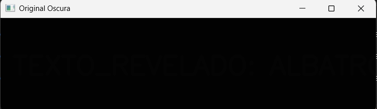
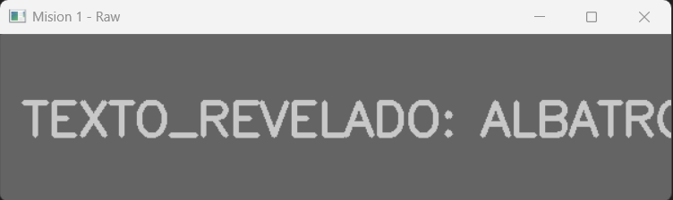
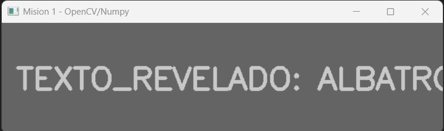
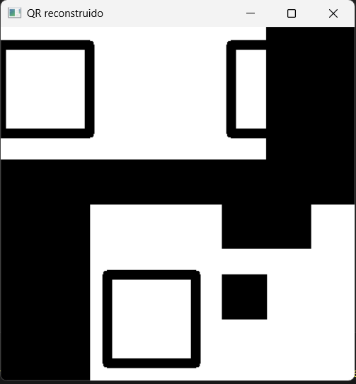
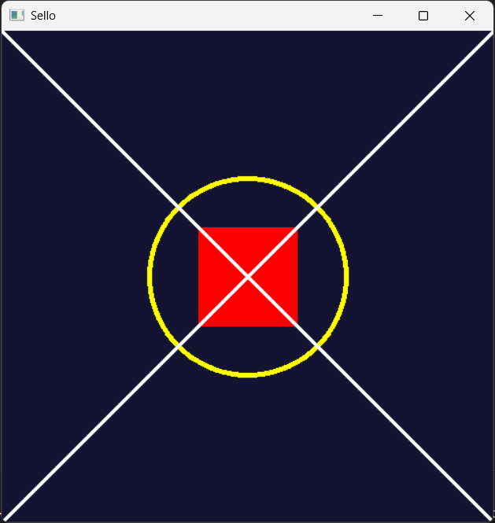
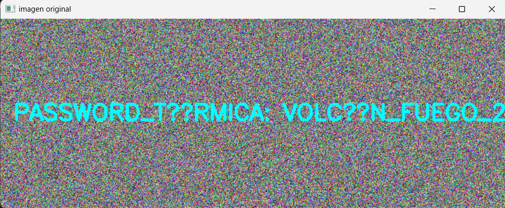
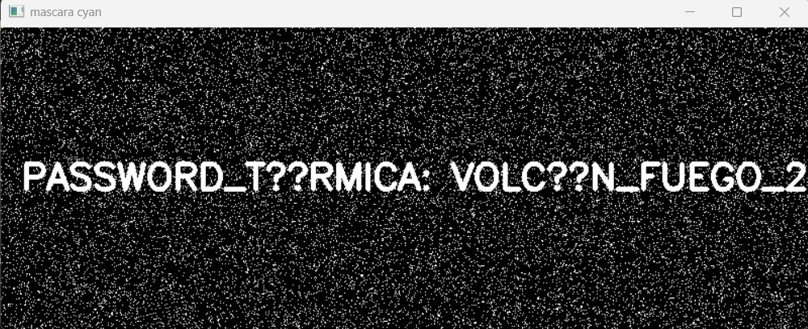
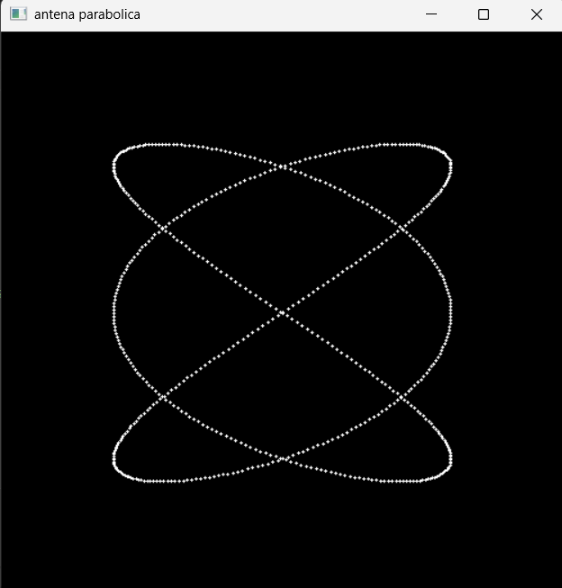

#  Reporte de Misión: Graficación Táctica
**Agente Especial:** [David Emanuel Ordaz Amezcua/24120340]

---
##  Evidencias de Misión

## Misión 1: El Mensaje Subexpuesto (Operadores Puntuales)

### Código utilizado

``` python
import cv2
import numpy as np

imagen = cv2.imread(r"C:\Users\death\Desktop\Examen\m1_oscura.png", cv2.IMREAD_GRAYSCALE)

# --- MODO RAW ---

h, w = imagen.shape
img_raw = np.zeros((h, w), dtype=np.uint8)

for i in range(h):
    for j in range(w):
        
        nuevo_pixel = int(imagen[i, j]) * 50
        
        if nuevo_pixel > 255:
            nuevo_pixel = 255
            
        img_raw[i, j] = nuevo_pixel

cv2.imwrite("m1_resuelto_raw.png", img_raw)

# --- MODO OPENCV / NUMPY ---

img_numpy = np.clip(imagen.astype(np.int32) * 50, 0, 255).astype(np.uint8)

cv2.imwrite("m1_resuelto_numpy.png", img_numpy)

cv2.imshow("Original Oscura", imagen)
cv2.imshow("Mision 1 - Raw", img_raw)
cv2.imshow("Mision 1 - OpenCV/Numpy", img_numpy)

cv2.waitKey(0)
cv2.destroyAllWindows()
```

### Resultado obtenido

### Resultado obtenido

Imagen original oscura



Resultado usando RAW



Resultado usando OpenCV / NumPy



------------------------------------------------------------------------

## Misión 2: El QR Fragmentado (Transformaciones Geométricas)

### Código utilizado

``` python
import cv2
import numpy as np

mitad1 = cv2.imread(r"C:\Users\death\Desktop\entorno\TareasGrafi\Examen\m2_mitad1.png")
mitad2 = cv2.imread(r"C:\Users\death\Desktop\entorno\TareasGrafi\Examen\m2_mitad2.png")

lienzo = np.zeros((400,400,3), dtype=np.uint8)

M1 = np.float32([
[1,0,-100],
[0,1,-50]
])

mitad1_mov = cv2.warpAffine(mitad1, M1, (400,400))
lienzo = cv2.add(lienzo, mitad1_mov)

h, w = mitad2.shape[:2]
centro = (w//2, h//2)

Mrot = cv2.getRotationMatrix2D(centro,180,1)
mitad2_rot = cv2.warpAffine(mitad2, Mrot, (w,h))

M2 = np.float32([
[1,0,100],
[0,1,200]
])

mitad2_mov = cv2.warpAffine(mitad2_rot, M2, (400,400))
lienzo = cv2.add(lienzo, mitad2_mov)

cv2.imshow("QR reconstruido", lienzo)

cv2.waitKey(0)
cv2.destroyAllWindows()
```

### Resultado obtenido



------------------------------------------------------------------------

## Misión 3: El Sello Biométrico (Primitivas de Dibujo)

### Código utilizado

``` python
import cv2
import numpy as np

lienzo = np.zeros((500,500,3), dtype=np.uint8)

lienzo[:] = (50,20,20)

cv2.circle(lienzo, (250,250), 100, (0,255,255), 3)

cv2.rectangle(lienzo, (200,200), (300,300), (0,0,255), -1)

cv2.line(lienzo, (0,0), (500,500), (255,255,255), 2)

cv2.line(lienzo, (500,0), (0,500), (255,255,255), 2)

cv2.imwrite("m3_sello_forjado.png", lienzo)

cv2.imshow("Sello", lienzo)
cv2.waitKey(0)
cv2.destroyAllWindows()
```

### Resultado obtenido



------------------------------------------------------------------------

## Misión 4: La Frecuencia Térmica (Modelo HSV)

### Código utilizado

``` python
import cv2
import numpy as np

img = cv2.imread(r"C:\Users\death\Desktop\entorno\TareasGrafi\Examen\m4_ruido.png")

hsv = cv2.cvtColor(img, cv2.COLOR_BGR2HSV)

bajo = np.array([80,100,100])
alto = np.array([100,255,255])

mascara = cv2.inRange(hsv, bajo, alto)

cv2.imshow("imagen original", img)
cv2.imshow("mascara cyan", mascara)

cv2.waitKey(0)
cv2.destroyAllWindows()
```

### Resultado obtenido

Imagen con ruido



Mascara filtrando color cyan



------------------------------------------------------------------------

## Misión 5: La Antena Parabólica (Ecuaciones Paramétricas)

### Código utilizado

``` python
import cv2
import numpy as np
import math

lienzo = np.zeros((500,500,3), dtype=np.uint8)

t = 0

while t <= 6.28:

    x = 250 + 150 * math.sin(3*t)
    y = 250 + 150 * math.sin(2*t)

    x = int(x)
    y = int(y)

    cv2.circle(lienzo, (x,y), 1, (255,255,255), -1)

    t = t + 0.01

cv2.imshow("antena parabolica", lienzo)

cv2.waitKey(0)
cv2.destroyAllWindows()
```

### Resultado obtenido



------------------------------------------------------------------------

---
##  Análisis del Analista (Reflexiones Finales)

1. **Sobre los Operadores Puntuales (Misión 1):** Matemáticamente, ¿qué pasaría si en lugar de multiplicar por 50, hubieras sumado 50 a cada píxel oscuro? ¿Se revelaría el texto igual de claro o la imagen perdería contraste?

> Si en lugar de multiplicar cada píxel por 50 se hubiera sumado 50, la
imagen se aclararía un poco pero el contraste no aumentaría tanto.
Multiplicar intensidades aumenta más la diferencia entre zonas oscuras y
claras, permitiendo que detalles ocultos se vuelvan visibles. En cambio,
sumar una constante solo desplaza los valores de intensidad sin mejorar
mucho el contraste.

2. **Sobre el Espacio HSV (Misión 4):** ¿Por qué el modelo de color BGR es ineficiente para la Recuperación de Información cuando buscamos "todos los tonos de azul celeste", y por qué el modelo HSV resuelve este problema con una sola variable?

> El modelo BGR representa colores mezclando azul, verde y rojo, por lo
que encontrar todos los tonos de un mismo color puede ser difícil si
cambia la iluminación. En HSV el color se separa en tono (Hue),
saturación y valor. El tono representa directamente el tipo de color,
por lo que es más fácil aislar un color específico como el cyan usando
solo el rango del Hue.

3. **Sobre Ecuaciones Paramétricas (Misión 5):** ¿Por qué las ecuaciones paramétricas (usando el parámetro t) son mejores para dibujar formas cerradas y complejas en graficación por computadora que usar la clásica función $y=f(x)$?

> Las ecuaciones paramétricas permiten calcular x e y a partir de un
parámetro t. Esto permite dibujar curvas cerradas o complejas que no
pueden describirse fácilmente con una función y=f(x). Usando un
parámetro que recorre la curva se pueden generar todos los puntos de la
figura y dibujarla en el plano.