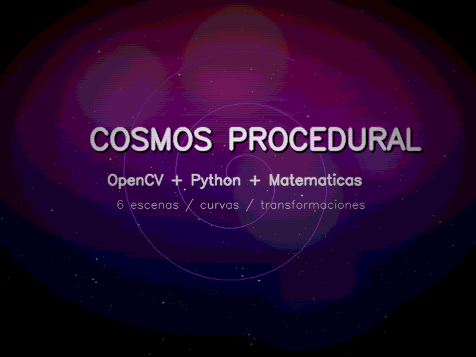
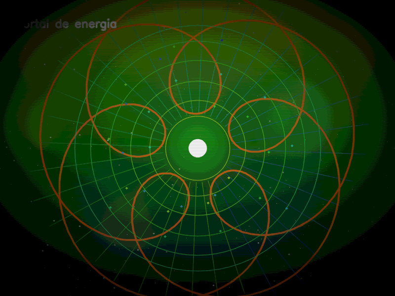
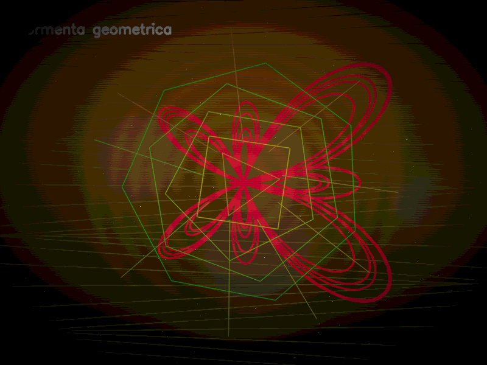
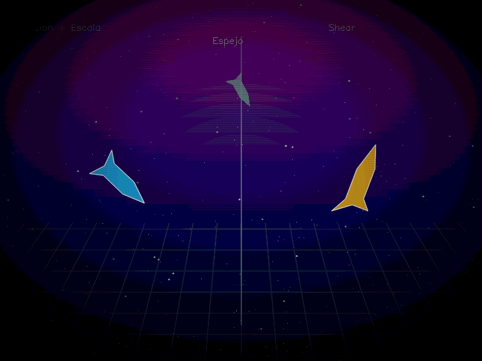
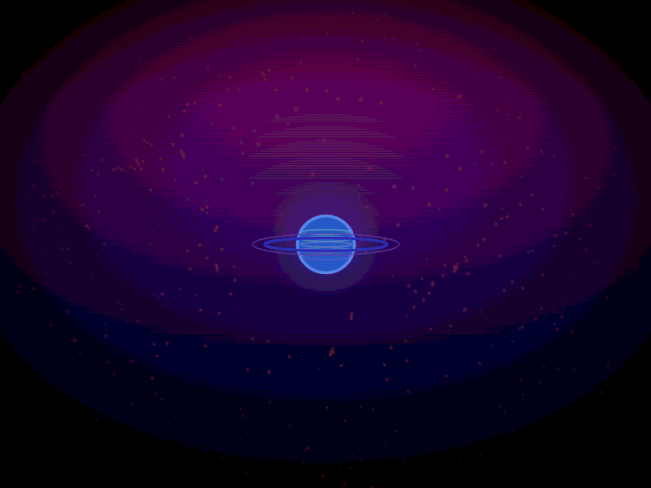
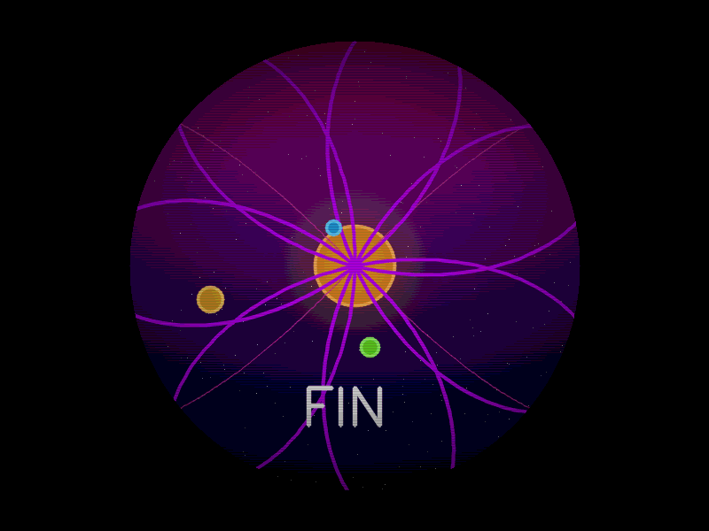
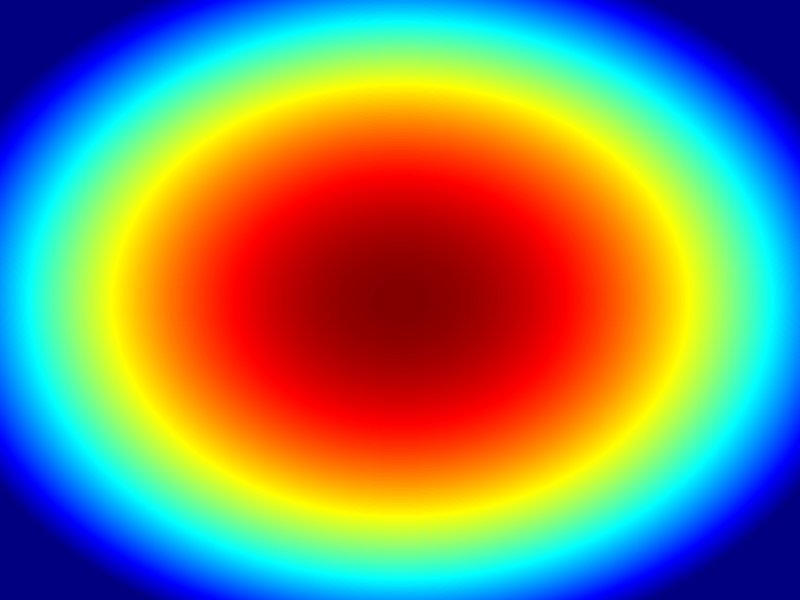
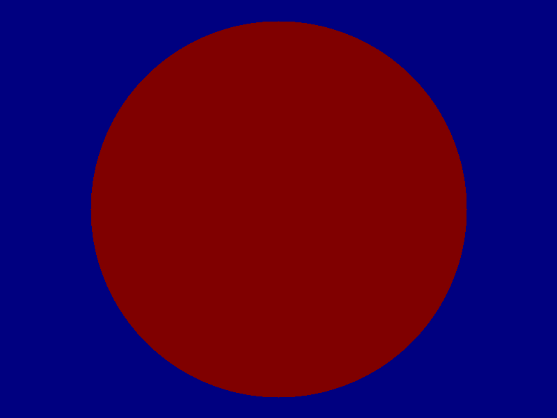

# Proyecto Final: Demo Procedural con OpenCV

---

## Portada

| Campo | Detalle |
|---|---|
| **Nombre completo** | David Emanuel Ordaz Amezcua |
| **Grupo** | A |
| **Materia** | Graficación |
| **Proyecto** | Demo Procedural — Cosmos Procedural |
| **Fecha** | Mayo 2026 |
| **Lenguaje / Librerías** | Python 3 · NumPy · OpenCV |

---

## Objetivo de la práctica

Construir un demo procedural de 60 segundos usando OpenCV y NumPy. El objetivo es generar una animación sin usar imágenes externas, modelos 3D ni texturas descargadas.

Todo lo que aparece en pantalla se genera con ecuaciones matemáticas, primitivas de dibujo y efectos de postprocesamiento. El proyecto incluye seis escenas, curvas paramétricas, transformaciones 2D, máscaras, composición por capas y exportación del resultado final en video.

En esta versión se hicieron mejoras visuales ligeras para que el demo se vea más completo sin volverlo demasiado pesado. Se agregaron pequeños brillos, más detalles en planetas, mejor composición de fondo y efectos menos agresivos para mantener un rendimiento estable.

---

## Timeline de escenas

El demo dura **60 segundos** y trabaja a **30 FPS**, por lo que genera aproximadamente **1 800 cuadros**. Está dividido en seis escenas de 10 segundos cada una.

Entre cada escena se usa una transición tipo *crossfade* durante los últimos 1.2 segundos. También se aplica un *fade-in* al inicio y un *fade-out* al final.

| # | Nombre | Intervalo | Descripción |
|---|---|---|---|
| 0 | Intro / Créditos | 00 – 10 s | Fondo estelar con degradado HSV, texto principal con brillo ligero y espiral de Arquímedes. |
| 1 | Portal de energía | 10 – 20 s | Portal procedural con líneas radiales, aros animados, núcleo brillante y curva epitrocoide. |
| 2 | Tormenta geométrica | 20 – 30 s | Curva mariposa, ondas de fondo, polígonos giratorios y halo energético moderado. |
| 3 | Transformaciones | 30 – 40 s | Nave espacial con rotación, escala, shear y espejo, acompañada por detalles visuales ligeros. |
| 4 | Campo de Asteroides | 40 – 50 s | Partículas orbitales optimizadas alrededor de un planeta con anillos. |
| 5 | Final / Sistema Solar | 50 – 60 s | Sistema solar procedural con planetas, curvas paramétricas, órbitas y máscara circular. |

### Diagrama de la timeline

```text
t(s)  0        10        20        30        40        50       60
      |──[0]───X──[1]────X──[2]────X──[3]────X──[4]────X──[5]──|
                   crossfade entre escenas
```

---

## Cambios realizados en la versión mejorada ligera

La versión anterior se veía más cargada, pero podía trabarse por exceso de partículas, desenfoques y brillos. Por eso se hizo una mejora más equilibrada:

| Área modificada | Cambio aplicado | Motivo |
|---|---|---|
| Partículas | Se redujo la cantidad en escenas pesadas | Mejorar rendimiento |
| Brillos | Se dejaron brillos suaves en textos, planetas y portal | Mejorar estética sin saturar |
| Planetas | Se agregaron sombras, bordes y anillos más claros | Dar más detalle visual |
| Portal | Se mejoró con aros, núcleo y líneas radiales moderadas | Hacerlo más llamativo |
| Tormenta geométrica | Se mantuvieron curvas y polígonos, pero con menos carga | Evitar trabones |
| Postprocesamiento | Viñeta, scanlines y posterización más suaves | Mejorar fluidez y legibilidad |

---

## Capturas de pantalla por escena

Las capturas se guardan automáticamente dentro de la carpeta `renders/`.

### Escena 0 — Intro / Créditos



Esta escena muestra el título del proyecto, un fondo con estrellas, un degradado HSV y una espiral de Arquímedes animada. En la versión ligera mejorada el texto conserva un efecto visual más limpio y menos pesado.

---

### Escena 1 — Portal de energía



Esta escena muestra un portal procedural formado por líneas radiales, aros animados, un núcleo brillante y una curva epitrocoide generada con ecuaciones paramétricas. El efecto se dejó más vistoso, pero sin saturar de partículas.

---

### Escena 2 — Tormenta geométrica



Esta escena genera una tormenta visual usando una curva mariposa, ondas horizontales, polígonos giratorios y composición por capas. Se conservaron los elementos matemáticos principales, pero con efectos más ligeros.

---

### Escena 3 — Transformaciones



Se dibuja una nave espacial y se le aplican distintas transformaciones: rotación, escala, shear y espejo. Esta escena demuestra el uso de matrices y composición de capas.

---

### Escena 4 — Campo de Asteroides



Se genera un campo de partículas que simula asteroides moviéndose alrededor de un planeta con anillos. En esta versión se redujo la cantidad de asteroides para mejorar el rendimiento.

---

### Escena 5 — Final / Sistema Solar



La escena final muestra un sistema solar procedural con planetas, curvas paramétricas y una máscara circular. El cierre mantiene un estilo espacial con órbitas y un enfoque visual en el centro.

---

## Capturas de pantalla de las máscaras generadas

Además de las escenas principales, también se guardan dos imágenes de máscaras utilizadas en el proyecto. Las máscaras se guardan con colores para que se puedan apreciar mejor en el reporte.

### Máscara de viñeta



Esta máscara se usa para oscurecer los bordes de la imagen y hacer que la atención se concentre en el centro. En la versión ligera se aplica con una intensidad menor para evitar que la imagen se vea demasiado oscura.

Código principal:

```python
nx = (xx - W * 0.5) / (W * 0.5)
ny = (yy - H * 0.5) / (H * 0.5)
r2 = nx * nx + ny * ny
mask = np.clip(1.0 - strength * r2, 0.0, 1.0)
```

---

### Máscara circular de la escena final



Esta máscara se usa en la escena final para mantener nítida la parte central del sistema solar y oscurecer/desenfocar el exterior.

Código principal:

```python
mask = np.zeros((H, W), np.uint8)
cv2.circle(mask, (W // 2, H // 2), r_m, 255, -1)
mask3 = cv2.merge([mask, mask, mask])
blurred = cv2.GaussianBlur(img, (0, 0), 10)
img[:] = np.where(mask3 > 0, img, (blurred.astype(np.float32) * 0.3).astype(np.uint8))
```

---

## Curvas paramétricas implementadas

En el proyecto se implementaron seis curvas o figuras paramétricas distintas. Todas se dibujan con `cv2.polylines`, usando puntos generados matemáticamente.

---

### 1. Espiral de Arquímedes

Se utiliza en la escena de introducción.

```text
x(θ) = θ cos(θ + t · 0.4)
y(θ) = θ sin(θ + t · 0.4)
```

Uso en el código:

```python
def arq_x(th):
    return th * np.cos(th + t * 0.4)

def arq_y(th):
    return th * np.sin(th + t * 0.4)
```

---

### 2. Epitrocoide

Se utiliza en la escena del portal de energía.

```text
x(θ) = (R+r)cos(θ) - d cos(((R+r)/r)θ + fase)
y(θ) = (R+r)sin(θ) - d sin(((R+r)/r)θ + fase)
```

Uso en el código:

```python
R = 5.0
r = 2.0
d = 4.5
phase = t * 0.8

def ex(th):
    return (R + r) * np.cos(th) - d * np.cos(((R + r) / r) * th + phase)

def ey(th):
    return (R + r) * np.sin(th) - d * np.sin(((R + r) / r) * th + phase)
```

---

### 3. Curva mariposa

Se utiliza en la escena de tormenta geométrica.

```text
x(θ) = sin(θ)(e^cos(θ) - 2cos(4θ) - sin^5(θ/12))
y(θ) = cos(θ)(e^cos(θ) - 2cos(4θ) - sin^5(θ/12))
```

Uso en el código:

```python
def bx(th):
    return np.sin(th) * (
        np.exp(np.cos(th))
        - 2 * np.cos(4 * th)
        - np.sin(th / 12) ** 5
    )

def by(th):
    return np.cos(th) * (
        np.exp(np.cos(th))
        - 2 * np.cos(4 * th)
        - np.sin(th / 12) ** 5
    )
```

---

### 4. Polígonos paramétricos giratorios

Se utilizan como figuras complementarias en la escena de tormenta geométrica.

```text
x(θ) = cx + r cos(θ + t)
y(θ) = cy + r sin(θ + t)
```

Uso en el código:

```python
for j in range(sides):
    ang = 2 * math.pi * j / sides + ang0
    x = int(cx + radius * math.cos(ang))
    y = int(cy + radius * math.sin(ang))
```

---

### 5. Lemniscata de Bernoulli

Se utiliza en la escena final.

```text
x(θ) = a cos(θ) / (1 + sin²(θ))
y(θ) = a sin(θ) cos(θ) / (1 + sin²(θ))
```

Uso en el código:

```python
a = 2.8 + 0.3 * math.sin(t * 0.6)

def lx(th):
    den = 1 + np.sin(th) ** 2
    return a * np.cos(th) / den

def ly(th):
    den = 1 + np.sin(th) ** 2
    return a * np.sin(th) * np.cos(th) / den
```

---

### 6. Hipotrocoide

También se utiliza en la escena final.

```text
x(θ) = (R-r)cos(θ) + d cos(((R-r)/r)θ + fase)
y(θ) = (R-r)sin(θ) - d sin(((R-r)/r)θ + fase)
```

Uso en el código:

```python
R, r, d = 7.0, 2.0, 5.0
w = (R - r) / r
phase = t * 0.3

def hx(th):
    return (R - r) * np.cos(th) + d * np.cos(w * th + phase)

def hy(th):
    return (R - r) * np.sin(th) - d * np.sin(w * th + phase)
```

---

## Tabla comparativa de curvas

| # | Curva | Escena | Uso visual |
|---|---|---|---|
| 1 | Espiral de Arquímedes | Intro | Fondo decorativo animado |
| 2 | Epitrocoide | Portal de energía | Forma principal del portal |
| 3 | Curva mariposa | Tormenta geométrica | Figura central de la tormenta |
| 4 | Polígonos paramétricos | Tormenta geométrica | Figuras giratorias complementarias |
| 5 | Lemniscata de Bernoulli | Final | Órbita en forma de infinito |
| 6 | Hipotrocoide | Final | Curva decorativa del sistema solar |

---

## Transformaciones implementadas

Las transformaciones se aplican principalmente en la escena 3 sobre una misma figura base: una nave espacial hecha con un polígono. También se usa rotación mediante matriz afín en la escena 2 para girar la curva mariposa.

---

### Rotación + escala

Se usa `cv2.getRotationMatrix2D` para hacer que la nave gire y cambie de tamaño.

```python
angle = t * 45
scale = 1.0 + 0.4 * math.sin(t * 1.2)

M_rot = cv2.getRotationMatrix2D((0, 0), angle, scale)
rot = (M_rot @ coords.T).T
```

---

### Shear

El shear o cizallamiento deforma la nave hacia los lados.

```python
sh = 0.5 * math.sin(t * 0.8)
M_shear = np.float32([[1, sh, 0], [0, 1, 0]])
sheared = (M_shear @ coords.T).T
```

---

### Espejo + composición

Se dibuja una copia de la nave en una capa temporal, se voltea horizontalmente y se mezcla con el frame principal.

```python
flipped = cv2.flip(tmp, 1)
img[:] = cv2.addWeighted(img, 1.0, flipped, 0.5, 0)
```

---

### Rotación de curva con matriz afín

En la escena de tormenta geométrica, la curva mariposa se rota con una matriz 2x3 generada por OpenCV.

```python
M = cv2.getRotationMatrix2D((cx, cy), angle, 1.0)
pts_rot = (M @ pts_h.T).T.astype(np.int32).reshape((-1, 1, 2))
```

---

## Tabla de transformaciones

| # | Transformación | Escena | Función usada | Resultado visual |
|---|---|---|---|---|
| 1 | Rotación + escala | 3 | `cv2.getRotationMatrix2D` | Nave girando y cambiando de tamaño |
| 2 | Shear | 3 | Matriz afín manual | Nave inclinándose |
| 3 | Espejo | 3 | `cv2.flip` | Reflejo horizontal de la nave |
| 4 | Composición | 1, 2, 3 y 5 | `cv2.addWeighted` | Mezcla de capas visuales |
| 5 | Rotación de curva | 2 | `cv2.getRotationMatrix2D` | Curva mariposa girando |

---

## Filtros y postprocesamiento

Se aplican tres efectos principales antes de mostrar o guardar cada frame. En esta versión se bajó la intensidad para que el demo corra más fluido.

### Viñeta

Oscurece suavemente los bordes del frame.

```python
frame = post_vignette(frame, 0.62)
```

### Scanlines

Agrega líneas horizontales muy suaves para dar una estética retro sin afectar tanto la claridad.

```python
frame = post_scanlines(frame, 0.07)
```

### Posterización

Reduce ligeramente los niveles de color para dar un aspecto gráfico.

```python
frame = post_posterize(frame, 22)
```

---

## Tabla de efectos

| # | Efecto | Función | Propósito |
|---|---|---|---|
| 1 | Viñeta | `post_vignette` | Enfocar la atención al centro |
| 2 | Scanlines | `post_scanlines` | Dar estilo retro de forma ligera |
| 3 | Posterización | `post_posterize` | Dar estilo gráfico sin saturar |
| 4 | Desenfoque | `cv2.GaussianBlur` | Suavizar halos y fondos en momentos específicos |
| 5 | Composición | `cv2.addWeighted` | Mezclar capas como brillos, planetas y transiciones |

---

## Primitivas de dibujo utilizadas

| Primitiva | Función OpenCV | Uso |
|---|---|---|
| Polilínea | `cv2.polylines` | Curvas paramétricas, polígonos y figuras geométricas |
| Círculo | `cv2.circle` | Planetas, satélites, pulsos, aros y máscaras |
| Polígono relleno | `cv2.fillPoly` | Nave espacial |
| Elipse | `cv2.ellipse` | Anillos de planetas |
| Línea | `cv2.line` | Rayos del portal, ondas y divisor visual |
| Texto | `cv2.putText` | Créditos y etiquetas |
| Composición | `cv2.addWeighted` | Mezcla de capas |

---

## Optimización aplicada

Para que el demo no se trabara, se hicieron ajustes de rendimiento:

| Elemento | Ajuste |
|---|---|
| Asteroides | Se redujo el número de partículas principales a una cantidad más manejable. |
| Brillos | Se evitaron brillos excesivos en todo el frame. |
| Desenfoques | Se dejaron solo en zonas donde aportan al efecto visual. |
| Postprocesamiento | Se bajó la intensidad de viñeta, scanlines y posterización. |
| Ventana de ejecución | Se puede desactivar `SHOW_WINDOW` para exportar sin vista previa. |

---

## Preguntas de análisis

### 1. ¿Por qué se usa `smoothstep` para las transiciones?

Porque permite que las transiciones no cambien de golpe. En lugar de pasar de una escena a otra de forma brusca, `smoothstep` suaviza el inicio y el final del cambio.

---

### 2. ¿Por qué se usa HSV para los fondos?

Porque HSV permite controlar el color de forma más cómoda usando el matiz. Así se pueden crear degradados y variaciones de color sin modificar manualmente los canales BGR.

---

### 3. ¿Por qué se usan semillas fijas para las estrellas?

Para que las estrellas mantengan la misma posición cada vez que se ejecuta el programa. Si fueran totalmente aleatorias en cada frame, parecería que parpadean demasiado.

---

### 4. ¿Qué función tienen las máscaras?

Las máscaras sirven para decidir en qué zonas se aplica un efecto. En este proyecto se usan para la viñeta y para enfocar la zona central de la escena final.

---

### 5. ¿Qué parte demuestra mejor las transformaciones?

La escena 3, porque muestra la misma figura base modificada con rotación, escala, shear y espejo. También la escena 2 usa rotación de puntos mediante una matriz afín para girar la curva mariposa.

---

### 6. ¿Por qué se cambió a una versión ligera mejorada?

Porque una versión con demasiadas partículas, brillos y desenfoques puede verse bien, pero también puede hacer que el programa vaya lento. Esta versión mantiene mejoras visuales, pero reduce la carga para que sea más estable.

---

## Cómo ejecutar el proyecto

Primero se instalan las librerías necesarias:

```bash
pip install numpy opencv-python
```

Después se ejecuta el archivo principal:

```bash
python demo_cosmos_ligero_mejorado.py
```

Al ejecutarse, el programa crea automáticamente la carpeta `renders/`, donde se guardan las seis capturas, las máscaras y el video final.

Si se quiere cerrar la ventana antes de que termine, se puede presionar `ESC`.

Si el equipo se siente lento al renderizar, se puede cambiar esta línea:

```python
SHOW_WINDOW = True
```

por esta:

```python
SHOW_WINDOW = False
```

De esa manera el programa exporta el video sin abrir la ventana de vista previa.

---

## Archivos generados

```text
renders/
├── demo_cosmos_ligero.mp4
├── escena_00.png
├── escena_01.png
├── escena_02.png
├── escena_03.png
├── escena_04.png
├── escena_05.png
├── mascara_vignette.png
└── mascara_circular_final.png
```

---

## Conclusión final

El proyecto cumple con los requisitos principales del demo procedural: tiene seis escenas controladas por una timeline, utiliza seis curvas o figuras paramétricas diferentes, aplica transformaciones 2D visibles, usa primitivas de OpenCV y agrega filtros de postprocesamiento.

Durante la práctica se comprobó que es posible construir una animación completa sin usar imágenes externas. Todo el resultado visual se obtiene mediante matemáticas, dibujo procedural y manipulación de frames. Además, dividir el programa en funciones por escena ayudó a mantener el código más ordenado y fácil de modificar.

La versión final mantiene las mismas seis escenas, pero mejora algunos detalles visuales: textos más claros, planetas con más detalle, portal más llamativo, tormenta geométrica más definida y un campo de asteroides optimizado. También se redujeron efectos pesados para que el demo se ejecute de forma más fluida.

Como mejora futura, se podría agregar música o sonido sincronizado con las transiciones, aumentar la resolución del video o agregar un modo de calidad baja y alta para elegir entre rendimiento o mejores efectos visuales.
